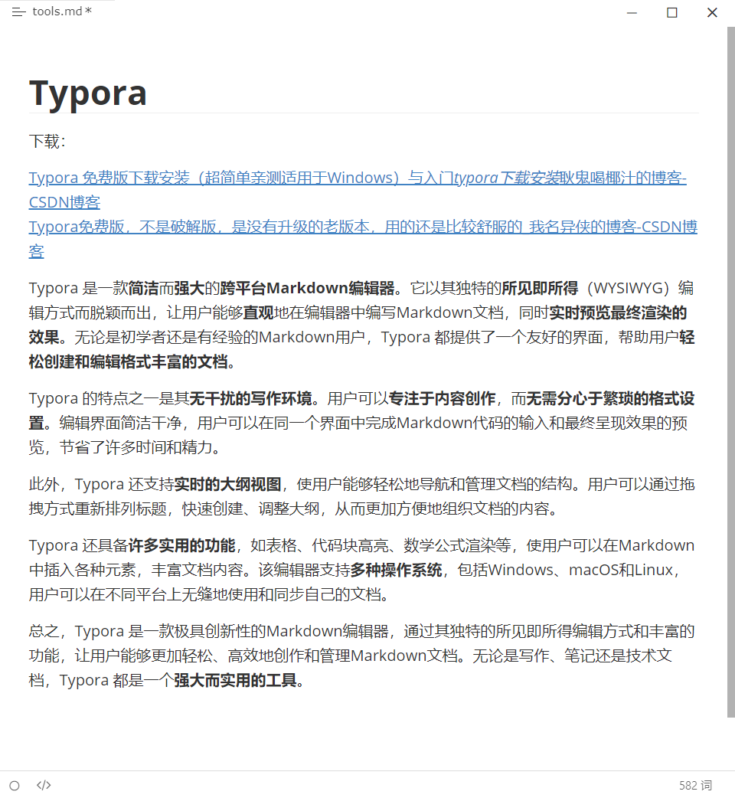

# tools
Share some useful tools  

## Typora

下载：

[Typora 免费版下载安装（超简单亲测适用于Windows）与入门_typora下载安装_耿鬼喝椰汁的博客-CSDN博客](https://blog.csdn.net/m0_57787115/article/details/129140535?ops_request_misc=%7B%22request%5Fid%22%3A%22169191397416800213050829%22%2C%22scm%22%3A%2220140713.130102334..%22%7D&request_id=169191397416800213050829&biz_id=0&utm_medium=distribute.pc_search_result.none-task-blog-2~all~top_positive~default-3-129140535-null-null.142^v92^controlT0_2&utm_term=typora&spm=1018.2226.3001.4187)
[Typora免费版，不是破解版，是没有升级的老版本，用的还是比较舒服的_我名异侠的博客-CSDN博客](https://blog.csdn.net/qq_44627608/article/details/121734682)

Typora 是一款**简洁**而**强大**的**跨平台Markdown编辑器**。它以其独特的**所见即所得**（WYSIWYG）编辑方式而脱颖而出，让用户能够**直观**地在编辑器中编写Markdown文档，同时**实时预览最终渲染的效果**。无论是初学者还是有经验的Markdown用户，Typora 都提供了一个友好的界面，帮助用户**轻松创建和编辑格式丰富的文档**。

Typora 的特点之一是其**无干扰的写作环境**。用户可以**专注于内容创作**，而**无需分心于繁琐的格式设置**。编辑界面简洁干净，用户可以在同一个界面中完成Markdown代码的输入和最终呈现效果的预览，节省了许多时间和精力。

此外，Typora 还支持**实时的大纲视图**，使用户能够轻松地导航和管理文档的结构。用户可以通过拖拽方式重新排列标题，快速创建、调整大纲，从而更加方便地组织文档的内容。

Typora 还具备**许多实用的功能**，如表格、代码块高亮、数学公式渲染等，使用户可以在Markdown中插入各种元素，丰富文档内容。该编辑器支持**多种操作系统**，包括Windows、macOS和Linux，用户可以在不同平台上无缝地使用和同步自己的文档。

总之，Typora 是一款极具创新性的Markdown编辑器，通过其独特的所见即所得编辑方式和丰富的功能，让用户能够更加轻松、高效地创作和管理Markdown文档。无论是写作、笔记还是技术文档，Typora 都是一个**强大而实用的工具**。

